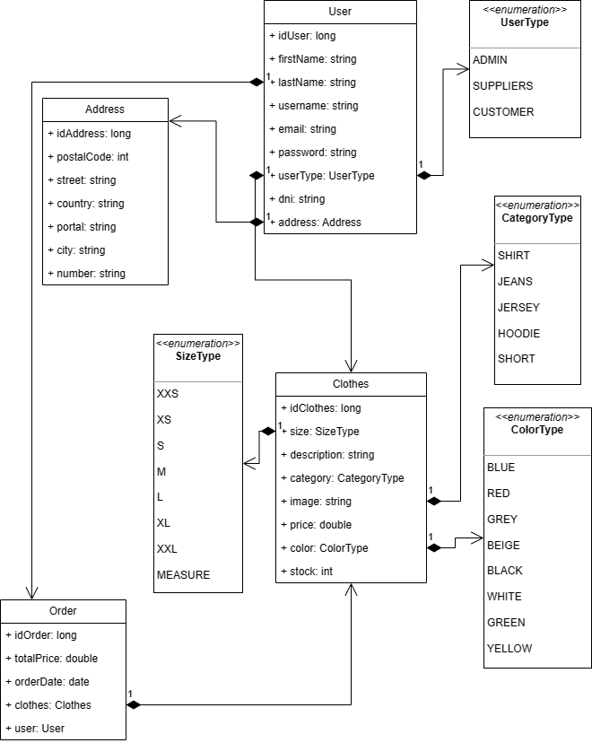

# Proyecto TFC 
La principal idea de mi trabajo es realizar una tienda o prototipo de tienda de ropa,
en que los usuarios se pueden registrar,hacer login,añadir articulos de ropa a la cesta...
Hay varios tipos de usuarios(admin,cliente,proveedor):
- admin = tiene acceso a todo.
- cliente = puede hacer login,registro,añadir y retirar productos del carrito.
- proveedor = puede añadir,editar,borrar articulos...

Principalmente la idea del backend es que esté realizado en spring,y el frontend en ionic.

## Diario
### 1º semana
En la primera semana de trabajo he esquematizado todo el proyecto,he buscado otras ideas de proyecto,además de hacer un diagrama UML de lo que a mi me gustaría que fuera finalmente este proyecto.

### 2º semana
En la segunda semana de trabajo he cambiado varias cosas del diagrama ya que no me gustaban o no me parecían útiles,además he creado el proyecto spring desde 0 fijandome en los apuntes que nos dió el profesor Juan Gualberto.
He creado un repositorio para guardar mi proyecto en github,el backend irá en un repositorio y el frontend en otro distinto para evitar problemas.

### 3º semana
Estoy creando los modelos(Clothes y sus respectivos tipos,colores...),también estoy creando los repos y los controller.
He retocado algunos datos del diagrama para que todo este perfectamente relacionado y me devuelvan las listas que yo necesito,la modificación consiste en cambiar la relación establecida de 1 a muchos en Order-Clothes a de muchos a muchos,es decir, crear una tabla auxiliar para que en el pedido pueda devolver una lista de ropa sin complicaciones,esta tabla se llamará OrderClothes.

### 4º semana
Estoy buscando en varias paginas web e incluso inteligencias artificiales para poder crear un logo para mi página web,he estado usando paginas como logomaker y inteligencias artificiales como mixo.io.

